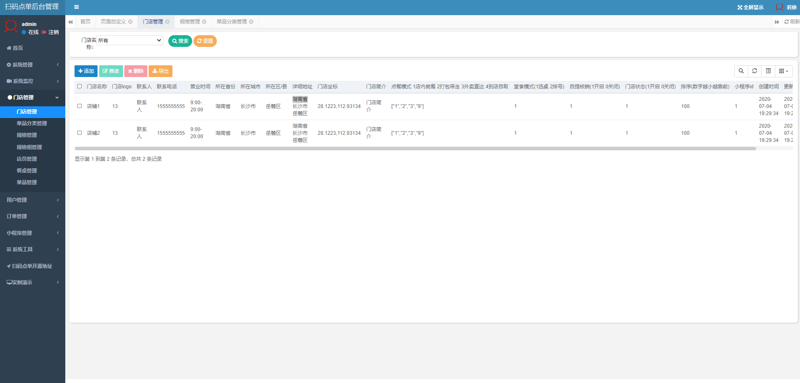

### 简介
采用Java语言开发的微信扫码点餐系统，后台采用ruoyi作为快速开发框架，微信小程序的登录使用到了JWT登录。


对应小程序端代码： [kbsmdd-wx](https://gitee.com/china-bin/kbsmdd-wx)

### 使用到的开源项目
1. 后台快速开发框架： [ruoyi](https://gitee.com/y_project/RuoYi?_from=gitee_search)
1. 微信开发sdk： [WxJava](https://gitee.com/binary/weixin-java-tools?_from=gitee_search)
1. 工具包： [Hutool](https://gitee.com/loolly/hutool?_from=gitee_search)

### 功能
1. 微信小程序扫码点单
1. 微信小程序外卖点单
1. 后台可对微信小程序主页进行自定义（如颜色、布局、图片等）
1. 支持微信支付与余额支付
1. 后台含有订单管理、门店管理等对小程序的管理功能

### 截图
#### 微信小程序界面


#### 后台管理界面




### 启动前注意
1. 请在application.yml中提前配置以下参数
```xml
app:
  #你项目的域名地址如： localhost:8082
  domain: 

wx:
  miniapp:
    configs:
      - appid: 
        secret: 
  pay:
    appId: 
    #证书路径
    keyPath: 
    #商户id
    mchId: 
    #商户秘钥
    mchKey: 
```
2. 数据库sql脚本的路径为 doc/ry-kbsmdd.sql

